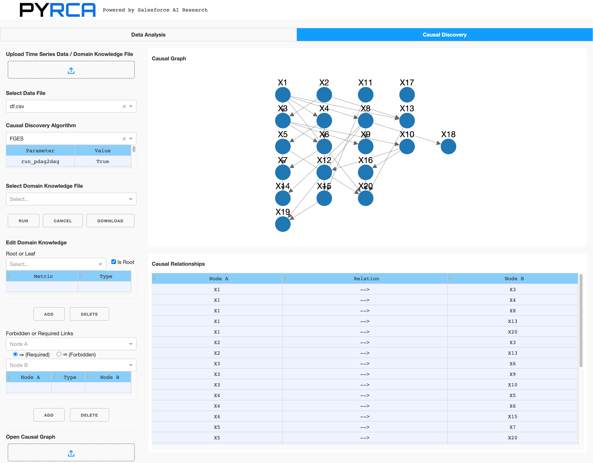
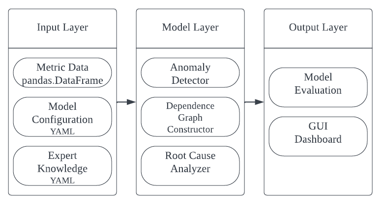

.. PyRCA documentation master file, created by
   sphinx-quickstart on Wed Oct  6 13:42:55 2021.
   You can adapt this file completely to your liking, but it should at least
   contain the root `toctree` directive.

Welcome to PyRCA's documentation!
========================================

Introduction
############

The adoption of microservices architectures is growing at a rapid pace, making multi-service applications
the standard paradigm in real-world IT applications. Typically, a multi-service application consists of
hundreds of interacting services, making it increasingly challenging to detect service failures and identify
their root causes. Root cause analysis (RCA) methods typically rely on KPI metrics, traces, or logs monitored
on these services to determine the root causes when a system failure is detected. Such methods can aid
engineers and SREs in the troubleshooting process.

PyRCA is a Python machine-learning library designed to facilitate root cause analysis by offering various
state-of-the-art RCA algorithms and an end-to-end pipeline for building RCA solutions. At present, PyRCA
primarily focuses on metric-based RCA, including two types of algorithms: (1) identifying anomalous metrics
in parallel with the observed anomaly through metric data analysis, such as ε-diagnosis, and (2) identifying
root causes based on a topology/causal graph representing the causal relationships between the observed
metrics, such as Bayesian inference and Random Walk. PyRCA also provides a convenient tool for building
causal graphs from the observed time series data and domain knowledge, enabling users to develop graph-based
solutions quickly. Furthermore, PyRCA offers a benchmark for evaluating various RCA methods, which is
valuable for industry and academic research.

Installation
############

You can install :py:mod:`pyrca` from PyPI by calling ``pip install sfr-pyrca``. You may install from source by
cloning the PyRCA repo, navigating to the root directory, and calling
``pip install .``, or ``pip install -e .`` to install in editable mode. You may install additional dependencies:

- **For plotting & visualization**: Calling ``pip install sfr-pyrca[plot]``, or ``pip install .[plot]`` from the
  root directory of the repo.
- **Install all the dependencies**: Calling ``pip install sfr-pyrca[all]``, or ``pip install .[all]`` from the
  root directory of the repo.

Getting Started
###############

PyRCA provides a unified interface for training RCA models and finding root causes. To apply
a certain RCA method, you only need to specify:

- **The selected RCA method**: e.g., :py:mod:`pyrca.analyzers.bayesian.BayesianNetwork`,
  :py:mod:`pyrca.analyzers.epsilon_diagnosis.EpsilonDiagnosis`.
- **The method configuration**: e.g., :py:mod:`pyrca.analyzers.bayesian.BayesianNetworkConfig`,
  :py:mod:`pyrca.analyzers.epsilon_diagnosis.EpsilonDiagnosisConfig`.
- **Time series data for initialization/training**: e.g., A time series data in a
  pandas dataframe.
- **Abnormal time series data in an incident window**: The RCA methods require the anomalous
  KPI metrics in an incident window.

Let's take ``BayesianNetwork`` as an example. Suppose that ``graph_df`` is the pandas dataframe of
a graph representing the causal relationships between metrics (how to construct such causal graph
will be discussed later), and ``df`` is the pandas dataframe containing the historical observed time series
data (e.g., the index is the timestamp and each column represents one monitored metric). To train a
``BayesianNetwork``, you can simply run the following code:

.. code-block:: python

   from pyrca.analyzers.bayesian import BayesianNetwork
   model = BayesianNetwork(config=BayesianNetwork.config_class(graph=graph_df))
   model.train(df)
   model.save("model_folder")

After the model is trained, you can use it to find root causes of an incident given a list of anomalous
metrics detected by a certain anomaly detector, e.g.,

.. code-block:: python

   from pyrca.analyzers.bayesian import BayesianNetwork
   model = BayesianNetwork.load("model_folder")
   results = model.find_root_causes(["observed_anomalous_metric", ...])
   print(results.to_dict())

For other RCA methods, you can write similar code as above for finding root causes. For example, if you want
to try ``EpsilonDiagnosis``, you can initalize ``EpsilonDiagnosis`` as follows:

.. code-block:: python

   from pyrca.analyzers.epsilon_diagnosis import EpsilonDiagnosis
   model = EpsilonDiagnosis(config=EpsilonDiagnosis.config_class(alpha=0.01))
   model.train(normal_data)

Here ``normal_data`` is the historically observed time series data without anomalies. To find root causes,
you can run:

.. code-block:: python

   results = model.find_root_causes(abnormal_data)
   print(results.to_dict())

where ``abnormal_data`` is the time series data in an incident window.

As mentioned above, some RCA methods such as ``BayesianNetwork`` require causal graphs as their inputs. To construct such causal
graphs from the observed time series data, you can utilize our tool by running ``python -m pyrca.tools``.
This command will launch a Dash app for time series data analysis and causal discovery.

The dashboard enables users to experiment with different causal discovery methods, customize causal discovery
parameters, add domain knowledge constraints (e.g., root/leaf nodes, forbidden/required links), and visualize
the generated causal graphs. This feature simplifies the process of manually revising causal graphs based on
domain knowledge. Users can download the graph generated by this tool if they are satisfied with it. The graph
can then be used by the RCA methods supported in PyRCA.

Alternatively, users can write code to build such graphs instead of using the dashboard. The package
``pyrca.graphs.causal`` includes several popular causal discovery methods that users can leverage.
All of these methods support domain knowledge constraints. For instance, if users wish to apply the PC
algorithm for building causal graphs on the observed time series data ``df``, the following code can be used:

.. code-block:: python

   from pyrca.graphs.causal.pc import PC
   model = PC(PC.config_class())
   graph_df = model.train(df)

If you have some domain knowledge constraints, you may run:

.. code-block:: python

   from pyrca.graphs.causal.pc import PC
   model = PC(PC.config_class(domain_knowledge_file="file_path"))
   graph_df = model.train(df)

The domain knowledge file has a YAML format, e.g.,

.. code-block:: yaml

   causal-graph:
     root-nodes: ["A", "B"]
     leaf-nodes: ["E", "F"]
     forbids:
       - ["A", "E"]
     requires:
       - ["A", "C"]

This domain knowledge file states that:

1. Metrics A and B must the root nodes,
2. Metrics E and F must be the leaf nodes,
3. There is no connection from A to E, and
4. There is a connection from A to C.

You can write your domain knowledge file based on this template for generating more reliable causal
graphs.

Library Design
##############

PyRCA has five key subpackages:

- :py:mod:`pyrca.graph`: This package contains the methods for discovering causal graphs from metric data.
- :py:mod:`pyrca.outliers`: This package contains some statistical based anomaly detectors used for detecting
  anomalous metrics. We will include more methods in this package in the future.
- :py:mod:`pyrca.analyzers`: This package contains all the supported RCA methods, e.g., Bayesian inference,
  Random walk, etc.
- :py:mod:`pyrca.tools`: This includes the dashboard tools for analyzing time series and building
  causal graphs, and the evaluation metric of RCA results.
- :py:mod:`pyrca.simulation`: This package contains the methods for simulated data generation.

The following figure demonstrates the main architecture of the library.

How to Contribute
#################

We welcome the contribution from the open-source community to improve the library!
Before you get started, clone this repo, run ``pip install pre-commit``, and run ``pre-commit install``
from the root directory of the repo. This will ensure all files are formatted correctly and contain
the appropriate license headers whenever you make a commit.

To add a new RCA method into the library, you may follow the steps below:
1. Create a new python script file for this RCA method in the ``pyrca/analyzers`` folder.
2. Create the configuration class that inherits from ``pyrca.base.BaseConfig``.
3. Create the method class that inherits from :py:mod:`pyrca.analyzers.base.BaseRCA`. The constructor for the new
method takes the new configuration instance as its input.
4. Implement the ``train`` function that trains or initializes the new method.
5. Implement the ``find_root_causes`` function that returns a :py:mod:`pyrca.analyzers.base.RCAResults`
instance storing root cause analysis results.

To add a new causal discovery method, you may follow the following steps:
1. Create a new python script file for this RCA method in the ``pyrca/graphs/causal`` folder.
2. Create the configuration class that inherits from :py:mod:`pyrca.graphs.causal.base.CausalModelConfig`.
3. Create the method class that inherits from :py:mod:`pyrca.graphs.causal.base.CausalModel`.
The constructor for the new method takes the new configuration instance as its input.
4. Implement the ``_train`` function that returns the discovered casual graph. The input parameters
of ``_train`` are the time series dataframe, the lists of forbidden and required links, and other
additional parameters.

.. toctree::
   :maxdepth: 4
   :caption: Contents:

   pyrca

Indices and tables
==================

* :ref:`genindex`
* :ref:`modindex`
* :ref:`search`
